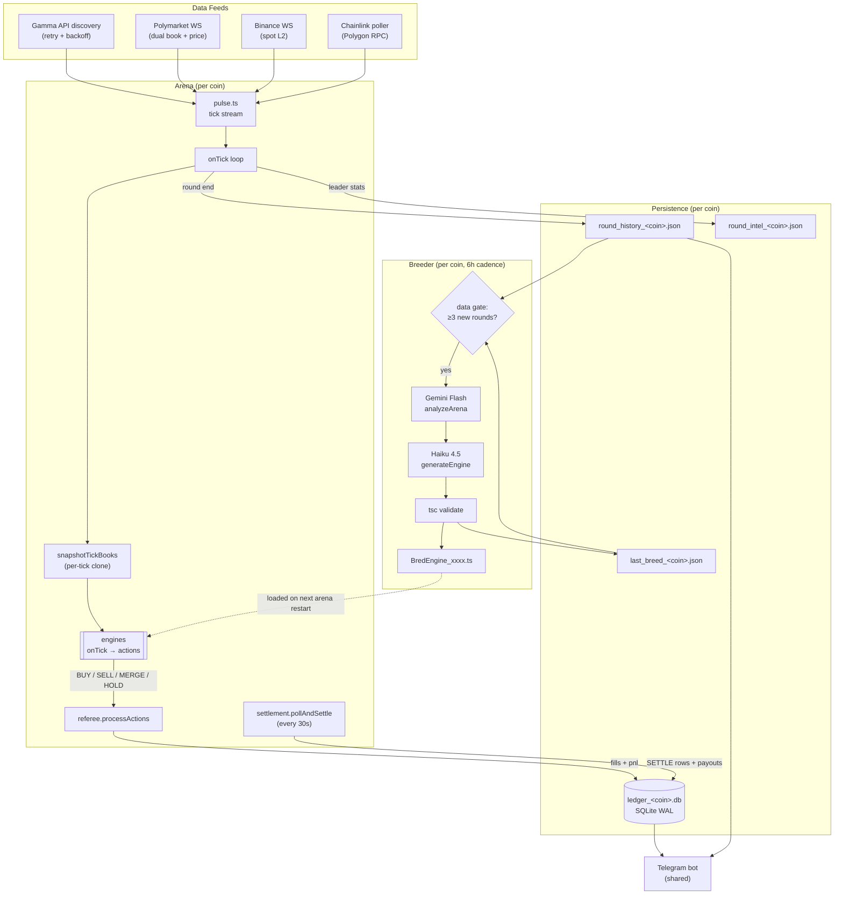
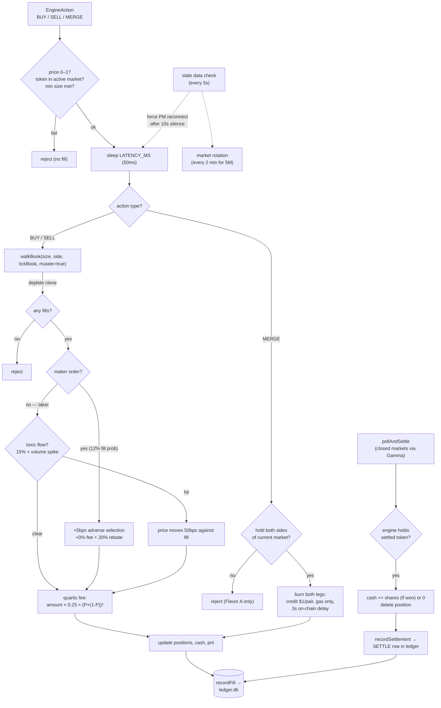

# Quant Farm — Evolutionary Arena for Polymarket

A multi-coin TypeScript arena where AI-bred trading engines compete on **live Polymarket 5-minute crypto binary markets** (BTC / ETH / SOL). A high-fidelity referee simulates dual orderbooks, the 2026 quartic fee model, latency, toxic flow, fill decay, oracle noise, and on-chain merge latency.

The goal: evolve engines that can survive the structural costs of a real prediction market and graduate to live execution with real capital.

---

## System Flow

How a tick travels from data feed → engines → fills → settlement → breeder.



**Key invariants:**
- Books are snapshot-and-cloned **once per tick**; engines share liquidity depletion within a tick (no ghost liquidity).
- Settlement writes a `SETTLE` row to the ledger, so `SUM(pnl)` reflects true outcomes (settlement wins are not silent cash bumps).
- Breeder is gated on **new round count**, not wall clock — deploys never fire fresh codegen on identical data.

---

## Referee / Simulator

What happens to a single `EngineAction` between submission and the ledger.



**The referee is the validator.** Engines submit intent; the referee determines whether and how that intent fills, using the *real* PM book at that moment, *real* fees, *real* latency, and *real* settlement payouts. Engines cannot lie about price or fabricate liquidity.

---

## Quick Start

```bash
npm install
npm run build       # tsc compile
npm run test:unit   # 39 tests — must all pass before deploy
```

### Run a single arena locally

```bash
ARENA_COIN=btc npm run arena:dry      # simulated random-walk pulse
ARENA_COIN=btc npm run arena:live     # live PM + Binance + Chainlink
npm run arena:1round:dry              # quick 1-min round for testing
```

### Production (multi-coin via PM2)

The shipped `ecosystem.config.js` runs **7 processes**:

```
quant-arena-btc      quant-breeder-btc
quant-arena-eth      quant-breeder-eth     quant-telegram
quant-arena-sol      quant-breeder-sol
```

Each arena auto-discovers active 5M markets for its coin. Each breeder evolves engines using only that coin's history. Telegram is shared.

```bash
pm2 start ecosystem.config.js
pm2 logs quant-arena-btc
pm2 logs quant-breeder-btc
```

### Deploy to VPS

```bash
bash scripts/deploy.sh
```

rsync to `165.22.29.245`, rebuild, `pm2 restart`. Excludes `data/`, `node_modules`, `.git`, `.env`, and `BredEngine_*` (preserved on VPS).

---

## The Quartic Fee Model

Polymarket's 2026 dynamic fee for crypto markets:

```
fee = amount × 0.25 × (P × (1−P))²
```

| Price | Fee % | Fee on $100 |
|------:|------:|------------:|
| 0.01 | 0.0025% | $0.0025 |
| 0.10 | 0.20%  | $0.20 |
| 0.30 | 1.10%  | $1.10 |
| 0.50 | **1.56%** | **$1.56** |
| 0.70 | 1.10%  | $1.10 |
| 0.90 | 0.20%  | $0.20 |
| 0.99 | 0.003% | $0.003 |

**Maker orders:** 0% fee + 20% rebate of taker fees, **12% fill probability** (was 60% — calibrated down to match real HFT queue priority), 5bps adverse selection.

**MERGE:** Flavor A only — engine must already hold both UP and DOWN of the same conditional pair. The referee burns both legs and credits $1 per pair (minus gas). Flavor B (buy opposite + merge atomically) was removed because it kept producing exploit paths in our sim. To do a Flavor B-style arb, emit a BUY for the opposite side first, wait for the fill, then call MERGE on a subsequent tick.

Winning engines must do at least one of:
1. Trade at the edges (P > 0.85 or P < 0.15) where fees vanish
2. Use MERGE to exit at mid-prices instead of crossing the spread
3. Have raw edge > 2% to overcome the fee at any price
4. Be a maker — accept the 12% fill rate and the 5bps adverse selection in exchange for zero fees and rebates

`feeAdjustedEdge()` on `BaseEngine` is the gatekeeper. Call it before every trade.

---

## Dual Orderbooks

UP and DOWN tokens have **independent orderbooks** delivered over PM WebSocket and routed by `asset_id`. UP + DOWN ≠ $1.00 — the gap is where merge arb profit lives.

Critical: an engine seeing a DOWN tick at $0.05 and buying UP tokens pays whatever the **UP book** says (~$0.95), not $0.05. The referee always fills from the correct token's book via `getBookForToken(action.tokenId)`. Never invert one book to derive the other.

---

## Writing an Engine

Drop a file in `src/engines/` extending `AbstractEngine`. Auto-loaded on next arena restart.

```typescript
import { AbstractEngine } from "./BaseEngine";
import type { EngineAction, EngineState, MarketTick, SignalSnapshot } from "../types";

export class MyEngine extends AbstractEngine {
  id = "my-engine-v1";
  name = "My Engine";
  version = "1.0.0";

  onTick(tick: MarketTick, state: EngineState, signals?: SignalSnapshot): EngineAction[] {
    if (tick.source !== "polymarket") return [];

    // Always check fee-adjusted edge before trading
    const modelProb = 0.60;
    const edge = this.feeAdjustedEdge(modelProb, tick.midPrice);
    if (!edge.profitable) return [];

    // Compare exit costs — sometimes MERGE beats SELL
    const exit = this.cheapestExit(tick.midPrice, 100, state.activeTokenId);

    return [this.buy(state.activeTokenId, tick.bestAsk, 50, {
      note: `edge=${edge.netEdge.toFixed(4)}`,
      signalSource: "my_signal",
    })];
  }
}
```

### BaseEngine helpers

| Method | Purpose |
|---|---|
| `feeAdjustedEdge(modelProb, marketPrice)` | Is this trade profitable after the quartic fee? |
| `cheapestExit(price, shares, tokenId)` | Should I SELL or MERGE? |
| `getPosition(tokenId)` | Current position |
| `portfolioValue(price)` | Cash + mark-to-market |
| `buy / sell / merge / hold` | Action builders |

### Engine rules

- Must call `feeAdjustedEdge()` before trading
- TokenId must match the active market (referee rejects fabricated tokens)
- ≥ 5 shares to SELL (CLOB), ≥ 1 share to MERGE (on-chain)
- `npm run test:unit` must pass before any deploy

---

## Breeder

Gemini Flash (analyst) + Claude Haiku 4.5 (coder) via OpenRouter.

| | |
|---|---|
| Cadence | 6h per coin (`BREED_INTERVAL_HOURS` to override) |
| Data gate | Skip cycle unless ≥ `MIN_NEW_ROUNDS_TO_BREED` (default 3) new rounds since last successful breed |
| Retries | 2 (compile-failure retries) |
| Coder model | `anthropic/claude-haiku-4-5` (override via `CODER_MODEL`) |
| Loading | Bred engines load on next natural arena restart — breeder no longer auto-restarts pm2 |

The data gate is the cost killer: every deploy / process restart used to fire 3 fresh Sonnet calls on identical data. Now the gate skips immediately if no new rounds have completed.

---

## Settlement

`pollAndSettle` runs every 30s per arena, queries Gamma for closed 5M markets, and:

1. Pays out cash to engines holding winning tokens (`shares × $1.00`)
2. Deletes losing positions (settled to $0)
3. **Writes a `SETTLE` row to the trades ledger** with the true payout pnl

Without #3, `SUM(pnl)` from the ledger lies — settlement wins silently bump cash without a row, so the column undercounts gains and overcounts losses. Always read leaderboards including SETTLE rows.

---

## Ledger Schema

`data/ledger_<coin>.db` (SQLite WAL, buffered writes flushed every 50 entries).

| Column | Notes |
|---|---|
| `round_id`, `engine_id`, `timestamp` | |
| `action` | `BUY` / `SELL` / `MERGE` / `SETTLE` |
| `token_id`, `price`, `size` | |
| `fee`, `rebate`, `slippage` | |
| `pnl` | Realized P&L for the row; settlement payouts now recorded too |
| `cash_after` | Engine cash post-fill |
| `signal_source`, `note` | |
| `toxic_flow` | 1 if adversely selected |
| `latency_ms` | |
| `order_type` | `taker` / `maker` / `merge` / `settle` |

```sql
-- Honest leaderboard (includes settlement payouts)
SELECT engine_id,
       COUNT(*) as trades,
       SUM(CASE WHEN action='SETTLE' THEN 1 ELSE 0 END) as settles,
       printf('%+.2f', SUM(pnl)) as pnl,
       printf('%.2f', SUM(fee)) as fees,
       SUM(toxic_flow) as toxic
FROM trades
GROUP BY engine_id
ORDER BY SUM(pnl) DESC;
```

---

## Key Environment Variables

| Variable | Default | Purpose |
|---|---|---|
| `ARENA_COIN` | `btc` | Per-process coin (set in ecosystem) |
| `ARENA_INSTANCE_ID` | `<coin>` | Ledger / intel suffix |
| `ROUND_DURATION_MS` | `3600000` | 1h rounds |
| `STARTING_CASH` | `50` | USDC per engine per round |
| `TICK_INTERVAL_MS` | `5000` | |
| `PEAK_FEE_RATE` | `0.015625` | Quartic peak (1.5625% at P=0.50) |
| `LATENCY_MS` | `50` | Realistic API lag |
| `MAKER_FILL_PROBABILITY` | `0.12` | Calibrated for HFT queue priority |
| `TOXIC_FLOW_PROBABILITY` | `0.15` | Per-fill toxic flow chance |
| `TOXIC_FLOW_BPS` | `50` | Adverse move size |
| `ON_CHAIN_LATENCY_MS` | `3000` | Polygon merge finality |
| `ORACLE_NOISE_BPS` | `35` | Settlement oracle noise |
| `BREED_INTERVAL_HOURS` | `6` | Breeder cadence per coin |
| `MIN_NEW_ROUNDS_TO_BREED` | `3` | Breeder data gate |
| `CODER_MODEL` | `anthropic/claude-haiku-4-5` | Breeder code-gen model |
| `OPENROUTER_API_KEY` | — | Required for breeder |

See `src/config.ts` for the full list.

---

## Layout

```
quant-farm/
├── src/
│   ├── arena.ts                 # main loop, per-coin
│   ├── referee.ts               # fee model, fills, toxic flow, merge
│   ├── pulse.ts                 # WS feeds + simulated pulse
│   ├── settlement.ts            # Gamma poller + SETTLE rows
│   ├── breeder.ts               # Gemini analysis + Haiku codegen
│   ├── discovery.ts             # Gamma API market discovery
│   ├── ledger.ts                # SQLite trade ledger
│   ├── historyStore.ts          # shared round history utilities
│   ├── signals.ts               # fear/greed, funding, DVOL, vol
│   ├── telegram.ts              # phone monitoring bot
│   ├── live/                    # live execution scaffolding (Phase 0+)
│   │   ├── clobClient.ts
│   │   ├── liveState.ts
│   │   ├── riskManager.ts
│   │   ├── graduation.ts
│   │   └── merger.ts
│   ├── engines/
│   │   ├── BaseEngine.ts        # AbstractEngine + helpers
│   │   ├── *.ts                 # 9 hand-built strategies
│   │   └── BredEngine_*.ts      # AI-generated, preserved on VPS
│   └── tests/
├── data/                        # per-coin: ledger, intel, history, breed marker
├── docs/
│   ├── LIVE_BUILD_PLAN.md
│   └── LIVE_EXECUTION.md
├── scripts/deploy.sh
├── ecosystem.config.js          # PM2 process definitions
└── CLAUDE.md                    # AI assistant instructions
```
